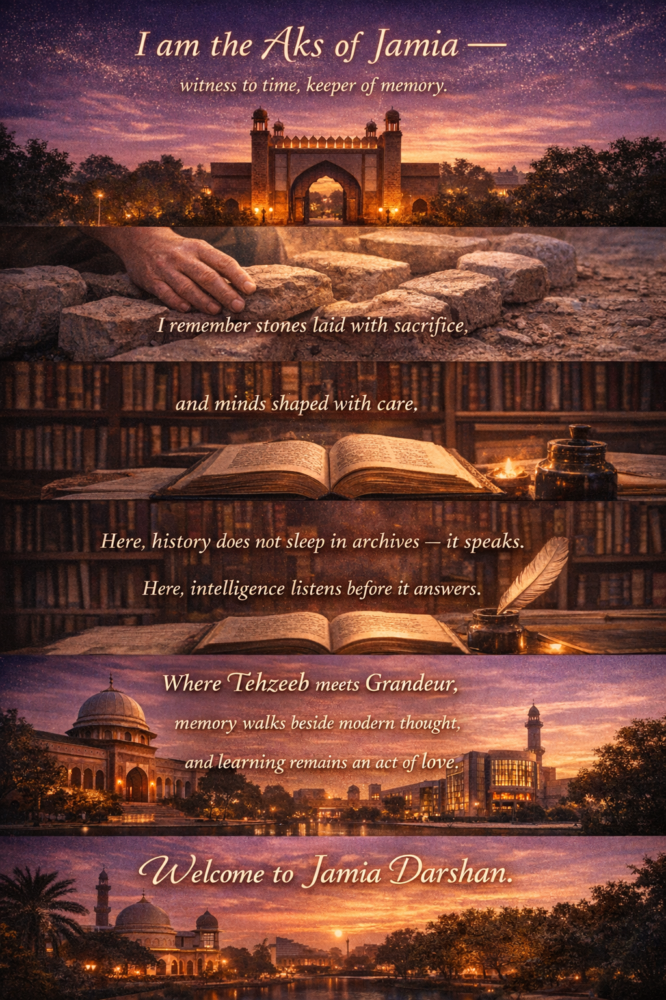

# 📜 JAMIA DARSHAN – CLI Chatbot (Hackathon Project)

 **Ever thought about talking with Jamia?**  
 Not the buildings of stone, but the Jamia that stands for *nothing but love* for its students —  
 a love that still carries the warmth and vision of its founders.

## 🎥 Project Intro

 *A glimpse into Jamia Darshan — where commands turn into conversations, and history speaks back.*
## 📌 Project Overview
**Jamia Darshan** is a Python-based **CLI Chatbot** centered around *Jamia Millia Islamia*.  
More than a utility, it is a **living narrator** — a wise observer who has walked Jamia’s lanes since **1920**.

Designed for a **Chatbot-focused Hackathon**, the project blends:
- 🤖 AI-driven storytelling  
- 🎭 A deeply crafted conversational **persona**  
- 🎓 Essential student utilities  

At its core, Jamia Darshan speaks not in dry facts, but in **memory, history, and Jamia Tehzeeb**.

## 🤖 The Chatbot – **“JAMIA DARSHAN”** (Core Highlight)

 *“Jamia’s heartbeat first stirred in 1920 .”*

### 🎭 Persona Design
Jamia Darshan speaks as:
- A **senior professor / long-time resident** of Jamia  
- Academic, poetic, calm, and welcoming  
- Deeply respectful of Jamia’s **Swadeshi roots** and freedom struggle  

### 🧠 Narrative Intelligence
- Always stays **in character**
- Answers simple questions with **context and storytelling**
- Treats Jamia as a **living legacy**, built *stone by stone*

### 📚 Knowledge Domains
- **History:** Aligarh → Karol Bagh → Okhla (1920–1935)  
- **Founders (with reverence):**  
  *Hakim Ajmal Khan*, *Maulana Mohammad Ali Jauhar*, *Dr. Zakir Husain*  
- **Landmarks:** Sathpula, Ghalib Statue, Zakir Husain Library, MCRC  
- **Culture:** *Jamia Tehzeeb* — nationalism, secularism, inclusion  
- **Modern Pride:** A++ NAAC, NIRF Rank 3 (2023), notable alumni  

⚙️ Powered by **Google Gemini 2.5 Flash**, guided by carefully engineered **system instructions** to preserve tone and identity.

---

## 🔐 User Authentication
- Register & Login via CLI  
- Persistent storage using `users.json`  

---

## 📊 Student Dashboard
- Attendance & Results (Semester 1 & 2 – simulated)
- End Semester Exam eligibility check  

---

## 📞 Contact Module
- Faculty (FET) details
- University address & official website  

---

## 🧠 Tech Stack
- **Python 3**
- **Google Gemini API**
- **dotenv & JSON**

---

## ✨ Why This Project Stands Out
- A chatbot with a **defined soul and voice**
- Strong **prompt engineering**, not generic AI replies
- Cultural + historical grounding
- Clean, extensible **CLI architecture**
- Built with **hackathon storytelling impact** in mind

---

## 🚀 Future Enhancements
- Multiple chatbot modes (History / Campus Walk / Founders)
- Conversation logs as **“Jamia Chronicles”**
- Sample dialogues for explainability
- CLI flags for quick Darshan access

---

# 👥 Team

**By Team Buggers**

## **Main Lead:** **Aadil Ansari**  
## **Team Members:**  
  - Aadil Ansari  
  - Ammar Husain  
  - Afzal Ali  
  - Sadiya Parveen  

---

 **Jamia Darshan does not answer questions.  
It remembers, reflects, and speaks — as Jamia itself would.**# JAMIA-DARSHAN
